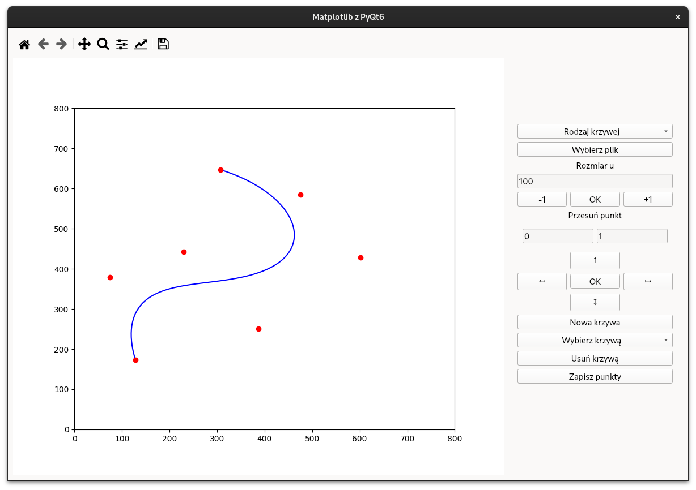
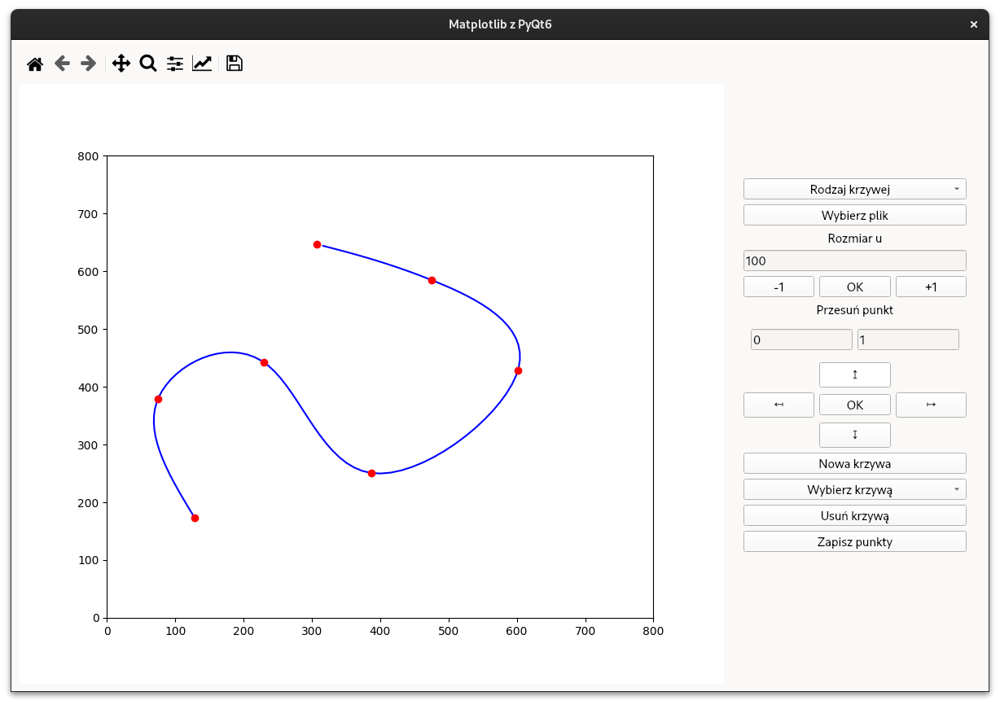
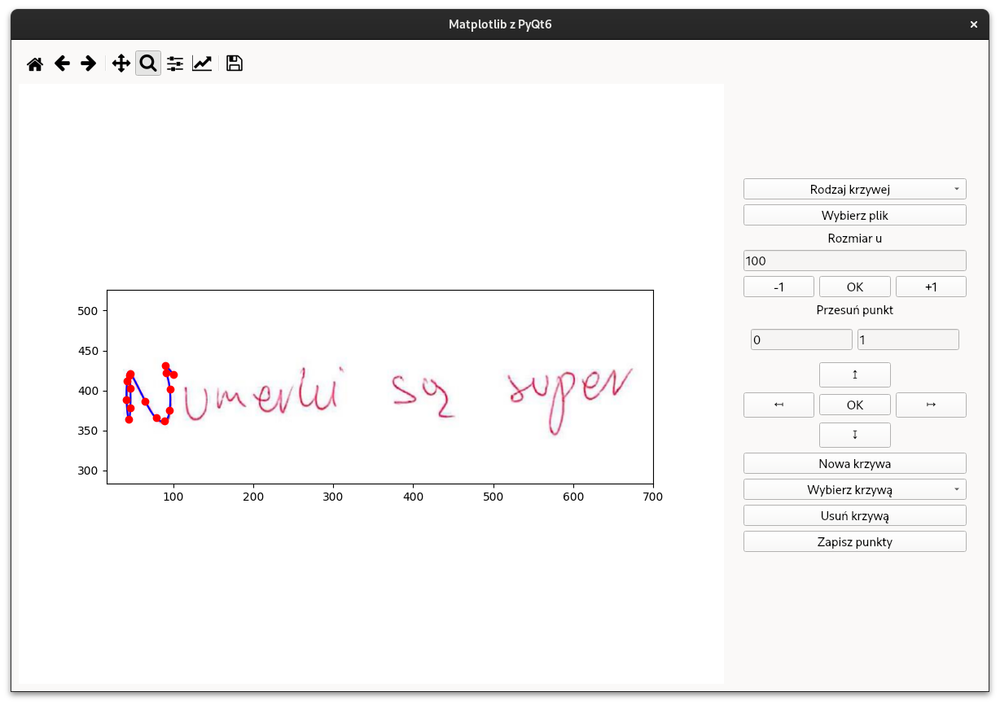

# Curve editor

Curve editor is a program that can draw and edit cubic splines and bézier curves. The project was created by Mikołaj Karapka for a **Numercial Analysis** course. The program was written in python and utilizes **PyQt6**, **Matplotlib** and **NumPy** libraries.

## Screenshots

### Plot of Bézier curve



### Plot of Cubic spline



### Plot with a pasted image



## Features

- Drawing and editing multiple Bézier curves
- Drawing and editing multiple Cubic splines
- Pasting image into plot
- Saving created curves to file
- Reducing the number of sharp edges in the function (Rozmiar u)
- Moving drawn points on the axis by a specific amount
- Zooming drawn curves

## Installation

```
poetry install
```

## Usage

### To start program:

```
poetry run project
```

### Shortcuts:

- **Draw a point**: Ctrl + left mouse button

- **Remove the last point**: Alt + left mouse button

## Explanation of algorithms to calculate  each curves
Click the link to open the explanation in exp.pdf:
[explanation](https://github.com/Mikolkar/curve_editor/blob/main/exp.pdf)
