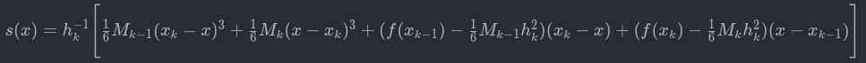
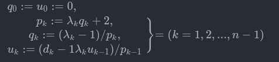
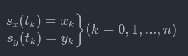

# Curve editor

Curve editor is a program that can draw and edit cubic splines and bézier curves. The project was created by Mikołaj Karapka for a **Numercial Analysis** course. The program was written in python and utilizes **PyQt6**, **Matplotlib** and **NumPy** libraries.

## Screenshots

### Plot of Bézier curve


### Plot of Cubic spline


### Plot with a pasted image


## Features

- Drawing and editing multiple Bézier curves
- Drawing and editing multiple Cubic splines
- Pasting image into plot
- Saving created curves to file
- Reducing the number of sharp edges in the function (Rozmiar u)
- Moving drawn points on the axis by a specific amount
- Zooming drawn curves

## Installation

```
poetry install
```

## Usage

### To start program:

```
poetry run project
```

### Shortcuts:

- **Draw a point**: Ctrl + left mouse button

- **Remove the last point**: Alt + left mouse button

## Explanation of algorithms to calculate  each curves

### Calculating cubic spline
#### **Theorem:**

$\forall n \in N, a = x_0 < x_1 < ... < x_n = b$ and function $f$ exists exacly one cubic piecewise interpolating function $s$, satisfying the conditions $s''(a) = s''(b) = 0$

  - For each interval $[x_{k-1}, x_k], k=(1,2,...,n)$ is:


 


where 
    
$M_k := s''(x_k), \lambda_k := h_k/(h_k+ h_k+1), h_k := x_k + x_{k-1}$

- Values:

    $M_k := s''(x_k), (k = 0,1,...,n; M_0 = M_n = 0)$

    satisfy the system of linear equations

    $\lambda_k M_{k-1} + 2M_k + (1-\lambda_k) M_{k+1} = 6f[x_{k-1},x_k,x_{k+1}], (k= 1, 2, ..., n-1)$

#### Therefore, we can calculate the points using the following algorithm:

 - We calculate auxiliary quantities

    $p_1, p_2, ..., p_{n-1}; \\ q_0, q_1, ..., q{n-1}; \\ u_0, u_1, ..., u{n-1}$

- in the following recursive way:




- where

    $d_k = 6f[x_{k-1},x_k,x{k+1}], \ \ (k = 1, 2, ..., n-1)$

- Then

    $M_{n-1} = u_{n-1}, \\
    M_k = u_k + q_k M_{k+1}, \ \ (k = n-2, n-3, ..., 1)$

In the end, for each point 
$p_i = (x_i, y_i), \ \ (i = 0,1, ..., n),$

We create

- $[t_0, t_1, ..., t_n]; \ \ t_j = \frac{j}{n}$

    and

    $[u_0, u_1, ..., u_m]; m =$(Rozmiar $u$); $u_j = \frac{j}{m}$

Next we evaluate




In the end we return a sequence of points on the plot

- $\bigg[\bigg(s_x(u_0), s_y(u_0)\bigg), ... \ ,  \bigg(s_x(u_m), s_y(u_m)\bigg)\bigg]$

### Calculating Bézier curve

To calculate new point on out plot we will use **De Casteljau's** algorithm:

A Bézier curve $B$ (of degree $n$, with constrol points $\beta_0, ..., \beta_n$) can be written in Berstein form as follows

- $B(t)=\sum_{i=0}^n \beta_i b_{i,n}(t),$

where $b$ is a Bernstain basis polynomial 

- $b_{i,n}(t) = \binom{n}{i}(1-t)^{n-i}t^i,$

The curve at point $t_0$ can be evaluated with the recurence relation

- $\beta^{(0)}_i := \beta_i, \ \ (i = 0, 1, ..., n),$

    $\beta^{(j)}_i := \beta^{(j - 1)}_i (1 - t_0) + \beta^{(j-1)}_{i+1} t_0, \ \ (i = 0, 1, ..., n - j; \ \ j = 1,2, ..., n)$

The result $B(t_0)$ is given by

- $B(t_0) = \beta^{(n)}_0$

Our program creates a sequence of points on the plot using these calculations:
- $\bigg[\bigg(B_x(u_0), B_y(u_0)\bigg), ... \ ,  \bigg(B_x(u_m), B_y(u_m)\bigg)\bigg]$
